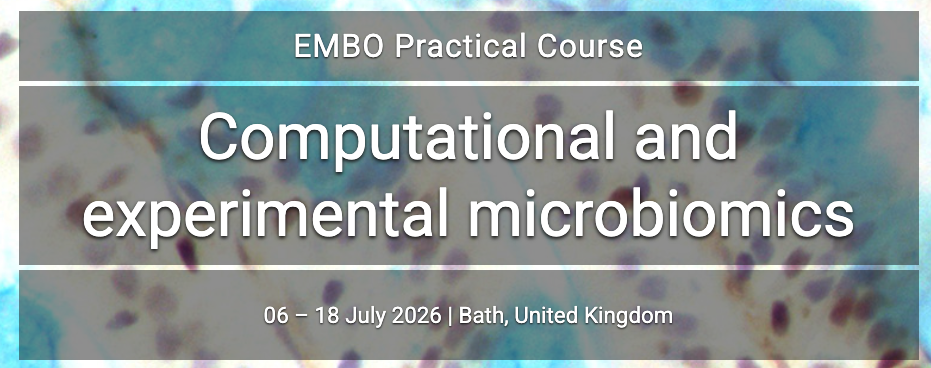
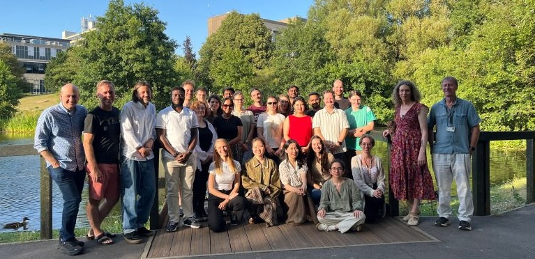
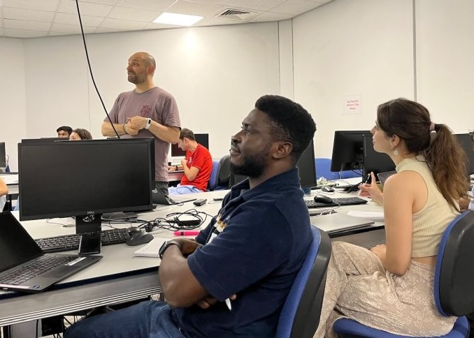

+++
title = "EMBO 2026 \"Microbiomics\" workshop"
date = "2026-07-18T09:00:00+01:00"
draft = false
categories = ["General updates"]
ShowReadingTime = true
ShowPostNavLinks = true
showToc = true
TocOpen = true
+++

Over the last 2 weeks at the University of Bath, we hosted an **EMBO Practical Course on "Computational and experimental microbiomics**, organised by Phil Ingham, Edan Foley, Tom Williams and Tiffany Taylor. [Link here](https://meetings.embo.org/event/26-microbiomics) (maybe it will die at some point?)

<figure class="blog-image-medium">
  
</figure>

I had the privilege to teach a bunch of really brilliant and talented early career researchers from all around the world about general microbiome analysis methods, as well as a very fun tutorial along with Edan Foley on the transcriptomics of zebrafish in response to conventional microbiome colonization. We also hosted very talented speakers from the field, including Mathieu Groussin, Pauline Scanlan, Bastien Boussau and others.

<figure class="blog-image-medium">
  
  <figcaption>The participants to the EMBO 2026 Microbiomics Workshop in Bath along with some of the organisers.</figcaption>
</figure>

<figure class="blog-image-medium">
  
  <figcaption>Guillaume giving a tutorial on microbiome diversity analyses to a presumably captivated audience.</figcaption>
</figure>

