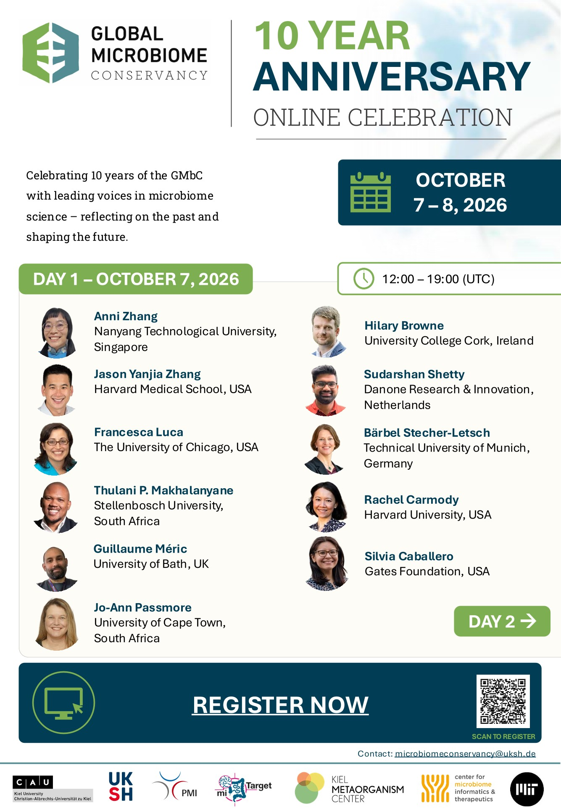
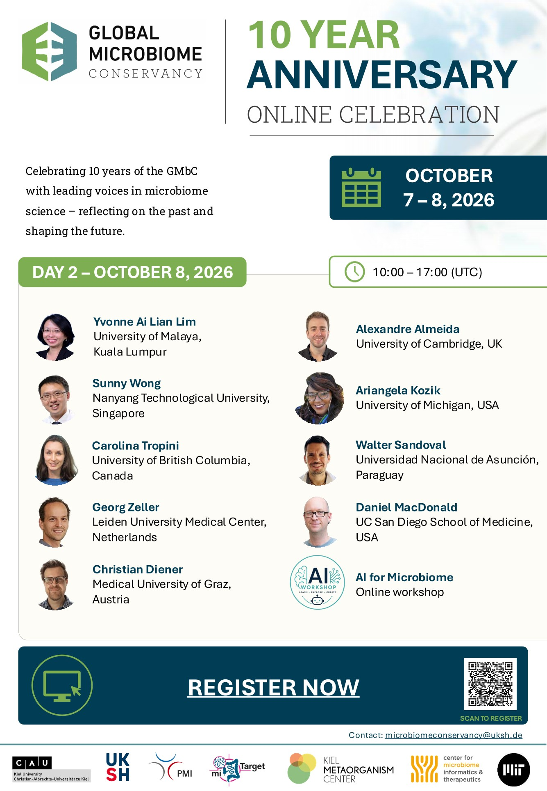

+++
title = "Keynote speaker presentation at the Global Microbiome Conservancy 10Y anniversary online conference"
date = "2026-08-03T09:00:00+01:00"
draft = false
categories = ["General updates"]
ShowReadingTime = true
ShowPostNavLinks = true
showToc = true
TocOpen = true
+++

Looking forward to participating to this! 

Next October will be held an online conference celebrating the 10 years anniversary of the [Global Microbiome Conservancy](https://microbiomeconservancy.org/) (GMbC), a non-profit organization focused on preserving the diversity of the human gut microbiome, particularly from underrepresented populations.

[Mathilde Poyet and Mathieu Groussin](https://microbiomeconservancy.org/team/lead_team/), the leading team of the GMbC, have organised a great line-up of speakers to mark the event:

<figure class="blog-image-medium">
  
  
  <figcaption>Speaker programme of the GMbC 10Y anniversary online conference.</figcaption>
</figure>

