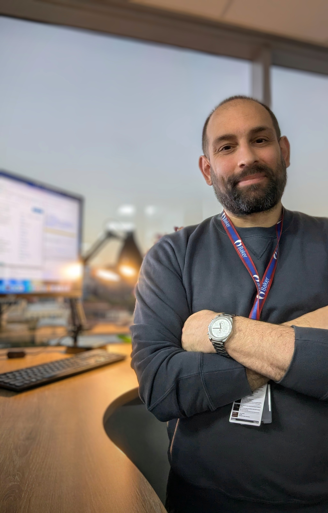
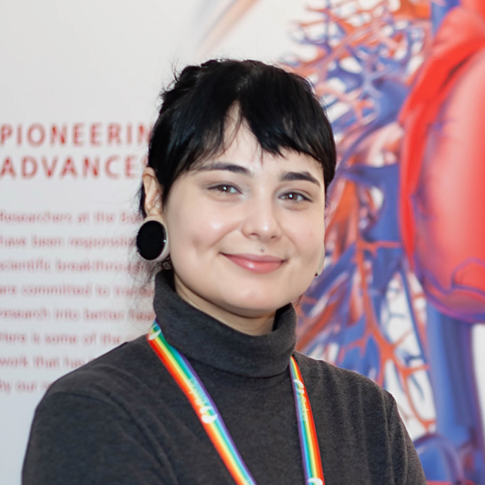

+++
title = "People"
+++

## Current members

<a class="person-card" href="guillaume/">
  
  

    <strong>Guillaume Méric</strong> 
    Main PI; Associate Professor in Human Microbiome and Population Health
  

</a>

<a class="person-card" href="camila/">
  
  

    <strong>Camila Gazolla Volpiano</strong> 
    Postdoctoral researcher, Baker HDI, Australia 
    Visiting Researcher, University of Bath, UK
  

</a>

  
PC

  

    <strong>Phoebe Cheong</strong> 
    PhD student 
    Co-supervised with Prof Francine Marques 
    Monash University, Melbourne, Australia
  

---

## Past members, co-supervised students, visiting scientists, mentees, etc.

<section class="past-group">
<h3>2025–now, University of Bath, UK</h3>

<ul>
<li><strong>2026</strong> Zak Bishop-Wright, final year BSc student</li>
<li><strong>2026</strong> Jake Isherwood, Masters student; MSc Molecular Biosciences, Bioinformatics</li>
<li><strong>2025</strong> Thomas Mullin, final year BSc student</li>
<li><strong>2025</strong> Pachalo Sibakwe, final year BSc student</li>
</ul>
</section>

<section class="past-group">
<h3>2018–2025, Baker Heart & Diabetes Institute, Australia</h3> 
<i>(as a postdoc, then independent)</i>
<li><strong>2024</strong> Dr Viktoria Weinberger, visiting PhD student from Graz, Austria</li>
<li><strong>2023–2024</strong> Dr Myo Naung, postdoctoral researcher</li>
<li><strong>2022–2023</strong> John-Luis Moretti, administrative officer</li>
<li><strong>2018–2020</strong> Dr Youwen Qin, PhD student, mentee and collaborator</li>
<li><strong>2019–2023</strong> Dr Fachrul Muhamad, PhD student, mentee and collaborator</li>
<li><strong>2018–2022</strong> Dr Yang Liu, PhD student, mentee and collaborator</li>
<li><strong>2018–2021</strong> Dr Jason Grealey, PhD student, mentee and collaborator</li>
</ul>
</section>

<section class="past-group">
<h3>2016–2018, University of Bath, UK</h3>
<i>(as a postdoc)</i>
<ul>
<li><strong>2016–2018</strong> Dr Evangelos Mourkas, PhD student</li>
<li><strong>2017</strong> Dr Patrick Hooper, BSc project student</li>
<li><strong>2016</strong> Prof Gabriel Rossi, visiting DVM/PhD student</li>
<li><strong>2017</strong> Dr Diana Espadinha, visiting PhD student</li>
<li><strong>2016–2017</strong> Dr Amandine Thépault, visiting PhD student</li>
<li><strong>2017–2018</strong> Dr Diego Flórez Cuadrado, visiting PhD student</li>
<li><strong>2017</strong> Dr Karina Frahm Kirk, visiting MD/PhD student</li>
</ul>
</section>

<section class="past-group">
<h3>2012–2016, Swansea University Medical School, UK</h3>
<i>(as a postdoc)</i>
<ul>
<li><strong>2013–2016</strong> A/Prof Leonardos Mageiros, PhD student</li>
<li><strong>2015–2016</strong> Hannah Evans, BSc project student</li>
<li><strong>2014–2015</strong> Dr Jake Ireland, BSc project student</li>
<li><strong>2012–2013</strong> Kasonde Chibelushi, BSc student</li>
<li><strong>2012–2013</strong> Dr Alicia Torralbo Montoro, visiting PhD student</li>
<li><strong>2012–2013</strong> Huw Barton, BSc project student</li>
</ul>
</section>

